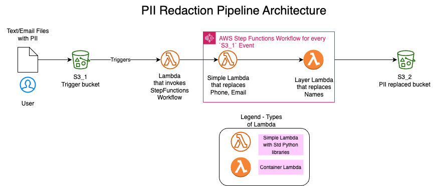
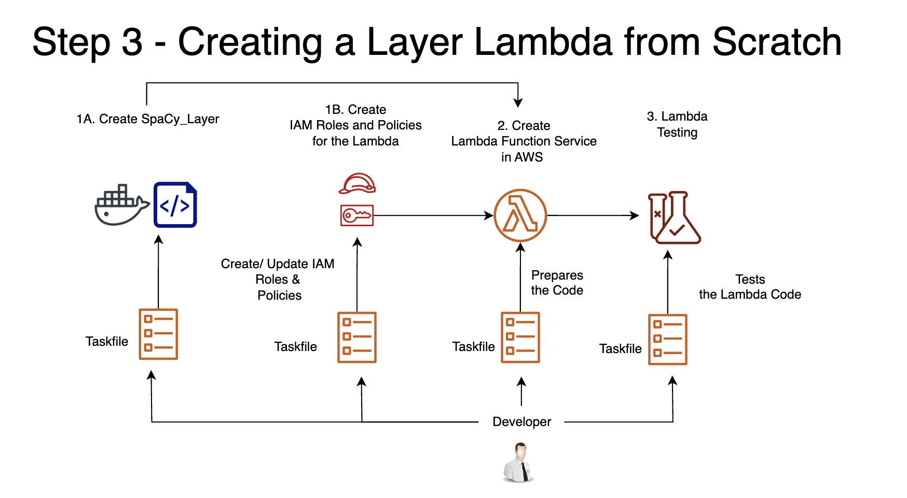

## I. Purpose of the repo
- How to build a Serverless Python NLP App in Cloud using replicable infrastructre provisioning codes

## II. What is built in this repo?

- Note: This pipeline is intentionally made simple for showing AWS CLI and Taskfile. Real-world Serverless Pipelines could be much more complex

## III. How are the AWS Lambdas, Stepfunctions and S3 buckets provisioned? - Using AWS CLI commands in Taskfiles

(note: this is Step 3 of the 5 step workflow described in this [PyCon Talk](https://toyota-connected-india.github.io/serverless_nlp_app/notebook/serverless_nlp_python_app_slides.slides.html#/10))

- AWS CLI has been used here. The taskfiles group the relevant AWS CLI commands
- You could also try the AWS CloudFormation or Terraform for provisioning the same infrastructure. 
    - For learning the fundamentals of provisioning AWS services, AWS CLI helps as it is more granualar. 
    - The verbose AWS CLI helps in a more fundamental learning over AWS CloudFormation or Terrform for AWS. 
    - However, for professional, production-grade infrastructure provisioning, do use AWS CloudFormation or Terrform

## IV. PyCon India 2023 Presentation

- This repo is originally intended as supporting material for the presentation here:
    - [PyCon'23 OpenSpaces Talk](https://toyota-connected-india.github.io/serverless_nlp_app/notebook/serverless_nlp_python_app_slides.slides.html)

## V. About the Speaker (or the creator of this repo):

- [Senthil Kumar](https://www.linkedin.com/in/senthilkumarm1901/) is a ML Engineer with Toyota Connected India (TCIN). He has spent 10+ years as a Data Analyst/ Data Scientist/ ML Enginner specialized in building Natural Language Processing applications using Machine Learning and Deep Learning.

- At Toyota Connected India, he co-develops Speech and NLP applications in AWS cloud with an awesome team of software engineers. In the years to come, he aspires to keep improving his software engineering and MLOps practices and to be strong in applied ML.